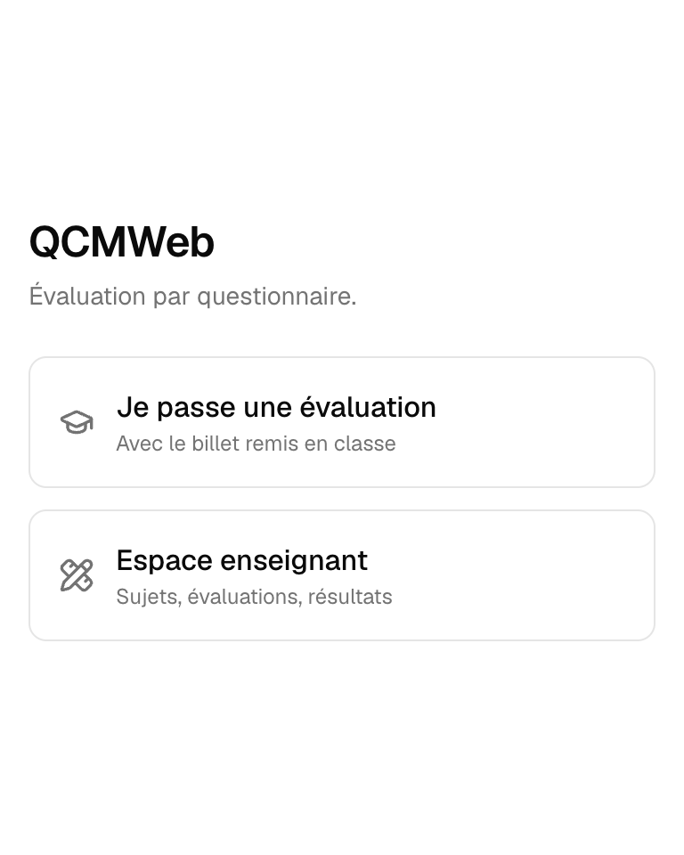
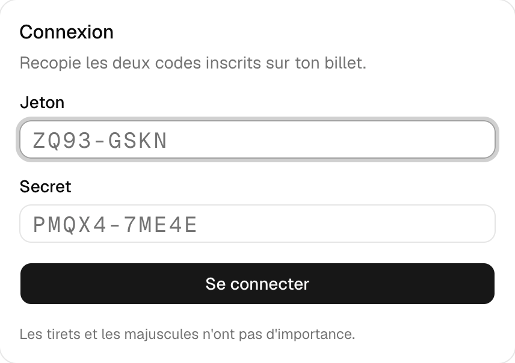
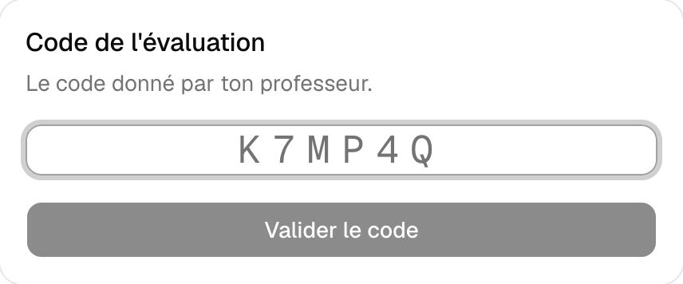
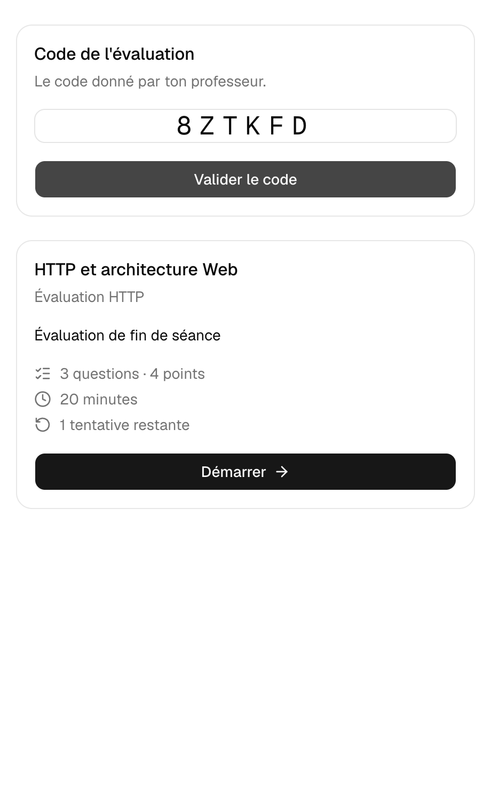
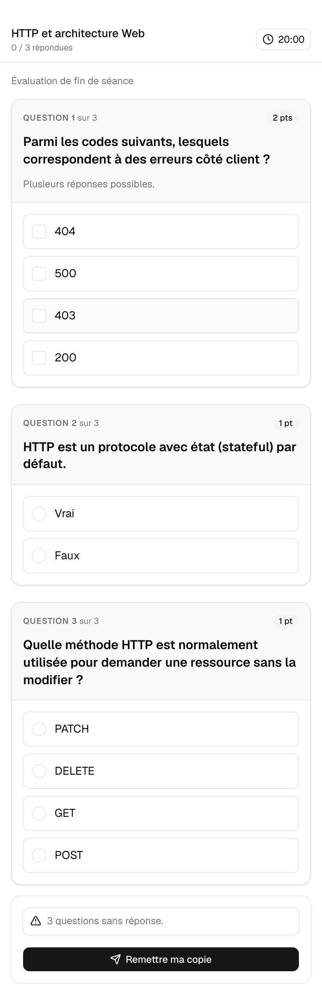
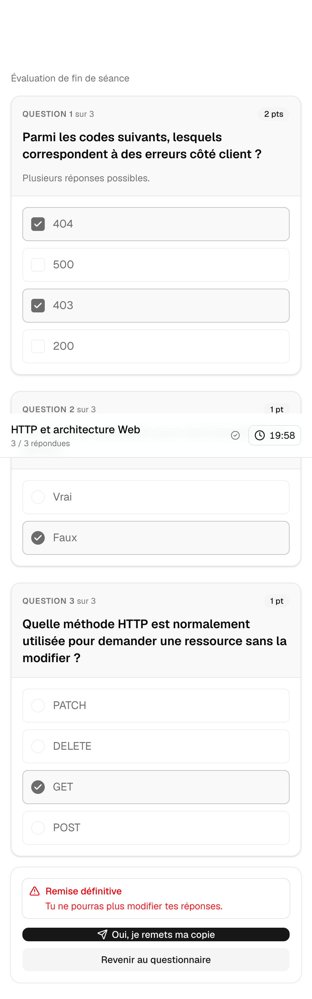
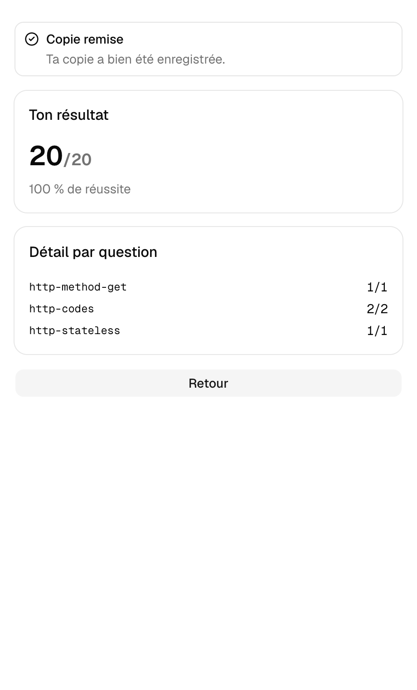

# QCMWeb — Guide de l'élève

Ce guide explique comment te connecter et passer une évaluation sur QCMWeb.
Tu n'as besoin de rien installer : un navigateur (celui de ton téléphone
convient très bien) suffit.

## Sommaire

1. [Ton billet](#1-ton-billet)
2. [Se connecter](#2-se-connecter)
3. [Entrer le code de l'évaluation](#3-entrer-le-code-de-lévaluation)
4. [Répondre au questionnaire](#4-répondre-au-questionnaire)
5. [Remettre ta copie](#5-remettre-ta-copie)
6. [Consulter ton résultat](#6-consulter-ton-résultat)
7. [Questions fréquentes](#7-questions-fréquentes)

---

## 1. Ton billet

Ton professeur t'a remis un billet en classe, avec deux codes personnels :

- le **jeton** identifie ton compte (par exemple `S9VB-GYHW`) ;
- le **secret** te sert de mot de passe (par exemple `92J3V-XPJWW`).

**Garde ce billet toute l'année** : ces deux codes ne changent pas d'une
évaluation à l'autre. S'il t'arrive de le perdre, préviens ton professeur, qui
pourra t'en régénérer un nouveau.

Les tirets et les majuscules n'ont pas d'importance : `s9vb gyhw` fonctionne
tout aussi bien que `S9VB-GYHW`.

---

## 2. Se connecter

Rends-toi sur l'adresse donnée par ton établissement, puis choisis **Je passe
une évaluation**.

Saisis ton jeton et ton secret, tels qu'ils figurent sur ton billet.

---

## 3. Entrer le code de l'évaluation

Ton professeur te communique un **code**, différent à chaque évaluation (par
exemple `8ZTKFD`). Saisis-le.

Les consignes de l'évaluation s'affichent : titre, nombre de questions,
barème, durée éventuelle et nombre de tentatives dont tu disposes.

Clique sur **Démarrer** quand tu es prêt. Si tu avais déjà commencé cette
évaluation (par exemple après une coupure de connexion), le bouton affichera
**Reprendre** à la place, et tu retrouveras exactement où tu en étais.

---

## 4. Répondre au questionnaire

Chaque question est présentée avec ses propositions. Touche une réponse pour
la sélectionner ; certaines questions en acceptent plusieurs à la fois (c'est
précisé sous la question).

Quelques points utiles :

- **Tes réponses sont enregistrées automatiquement**, au fur et à mesure. Si
  ta connexion coupe, rien n'est perdu : reconnecte-toi, entre à nouveau le
  code, et clique sur **Reprendre**.
- Si l'évaluation est chronométrée, le temps restant s'affiche en haut de
  l'écran. Il est calculé par le serveur, pas par l'horloge de ton appareil :
  même si l'heure de ton téléphone est fausse, le décompte reste juste.
- L'ordre des questions et des réponses peut être différent du voisin : c'est
  normal, c'est voulu.

---

## 5. Remettre ta copie

Une fois tes réponses données, clique sur **Remettre ma copie**. Une
confirmation t'est demandée, car **cette action est définitive** : une fois
confirmée, tu ne peux plus modifier tes réponses.

Si le temps imparti s'écoule avant que tu aies remis ta copie, celle-ci est
automatiquement remise avec les réponses déjà données.

---

## 6. Consulter ton résultat

Selon ce que ton professeur a choisi, ton résultat s'affiche immédiatement
après la remise, ou plus tard (par exemple après la fermeture de
l'évaluation pour toute la classe).

Quand il est disponible, tu retrouves ton score, ton pourcentage de réussite,
et éventuellement le détail question par question.

---

## 7. Questions fréquentes

**Je n'ai plus mon billet, que faire ?**
Préviens ton professeur : il peut te générer un nouveau jeton et un nouveau
secret à tout moment.

**Le code de l'évaluation ne fonctionne pas.**
Vérifie que tu l'as bien recopié, et qu'il correspond bien à l'évaluation en
cours (les codes sont valables une seule évaluation). S'il ne fonctionne
toujours pas, l'évaluation n'est peut-être pas encore ouverte, ou déjà fermée
— demande à ton professeur.

**J'ai fermé mon navigateur par erreur pendant l'épreuve.**
Aucune inquiétude : reconnecte-toi avec ton jeton et ton secret, saisis à
nouveau le code, et clique sur **Reprendre**. Tu retrouveras tes réponses.

**Puis-je repasser une évaluation pour améliorer mon score ?**
Cela dépend du nombre de tentatives autorisées par ton professeur pour cette
évaluation précise, indiqué sur l'écran des consignes.

**Est-ce que mes réponses peuvent être lues par quelqu'un d'autre ?**
Non. Ta copie n'est accessible qu'à toi et à ton professeur ; aucun autre
élève ne peut y accéder, même en connaissant ton jeton d'identification, sans
connaître aussi ton secret.
