# QCMWeb — Guide de l'enseignant

Ce guide explique, étape par étape, comment créer un groupe, distribuer les
codes d'accès à votre classe, obtenir un questionnaire, le relire, le diffuser,
puis consulter et exporter les résultats. Aucune compétence informatique
particulière n'est nécessaire.

Une seule règle à garder en tête tout au long de ce guide : **le serveur ne
connaît jamais les noms de vos élèves**. Il ne connaît que des jetons — des
codes du type `S9VB-GYHW`. C'est vous, sur votre ordinateur, qui savez à qui
correspond chaque jeton. Cela évite d'avoir à héberger la moindre liste
nominative, et une panne ou un piratage du serveur n'exposerait aucune
identité.

## Sommaire

1. [Se connecter](#1-se-connecter)
2. [Créer un groupe et distribuer les billets](#2-créer-un-groupe-et-distribuer-les-billets)
3. [Obtenir un questionnaire](#3-obtenir-un-questionnaire)
4. [Relire et valider le questionnaire](#4-relire-et-valider-le-questionnaire)
5. [Créer et diffuser une évaluation](#5-créer-et-diffuser-une-évaluation)
6. [Consulter et exporter les résultats](#6-consulter-et-exporter-les-résultats)
7. [Questions fréquentes](#7-questions-fréquentes)

---

## 1. Se connecter

Rendez-vous sur l'adresse de votre établissement (par exemple
`https://qcm.mon-lycee.fr`) et saisissez votre identifiant et votre mot de
passe.

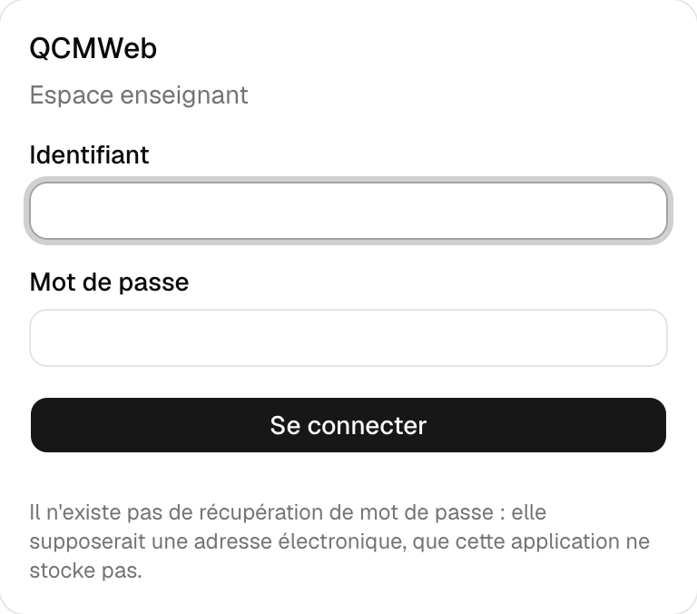

Il n'existe volontairement **aucun lien « mot de passe oublié »** : cela
supposerait de stocker votre adresse électronique, ce que l'application évite
justement de faire. Si vous perdez votre mot de passe, la personne qui a
installé QCMWeb pour votre établissement peut en générer un nouveau.

---

## 2. Créer un groupe et distribuer les billets

C'est ici que se joue la protection des données de vos élèves : la liste
nominative que vous chargez **ne quitte jamais votre navigateur**. Elle sert
uniquement, sur votre écran, à imprimer les billets — le serveur ne reçoit que
des jetons.

Rendez-vous dans l'onglet **Billets**.

### 2.1. Choisir ou créer le groupe

Donnez un nom à votre groupe (par exemple `1SIO`) et cliquez sur **Créer**.
L'année scolaire est déterminée automatiquement.

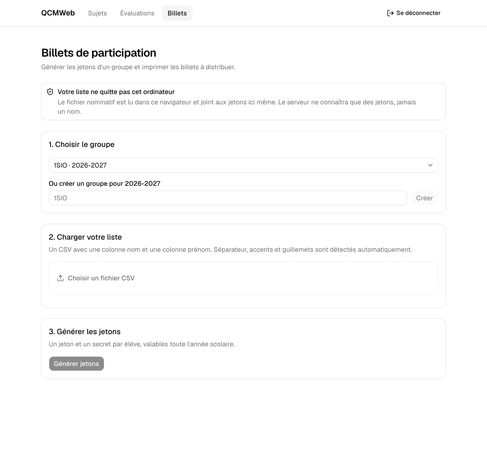

Si le groupe existe déjà, il suffit de le choisir dans la liste déroulante.

### 2.2. Charger la liste de la classe

Cliquez sur **Choisir un fichier CSV** et sélectionnez votre fichier d'élèves.
Le format attendu est simple : deux colonnes, une pour le nom, une pour le
prénom.

```csv
nom;prenom
Amrani;Sofia
Bernard;Lucas
Chevalier;Manon
Diallo;Ibrahim
```

L'application détecte automatiquement le séparateur (`;` ou `,`), les accents
et les guillemets : un export depuis Pronote, un tableur ou tout logiciel de
vie scolaire fonctionne généralement sans retouche.

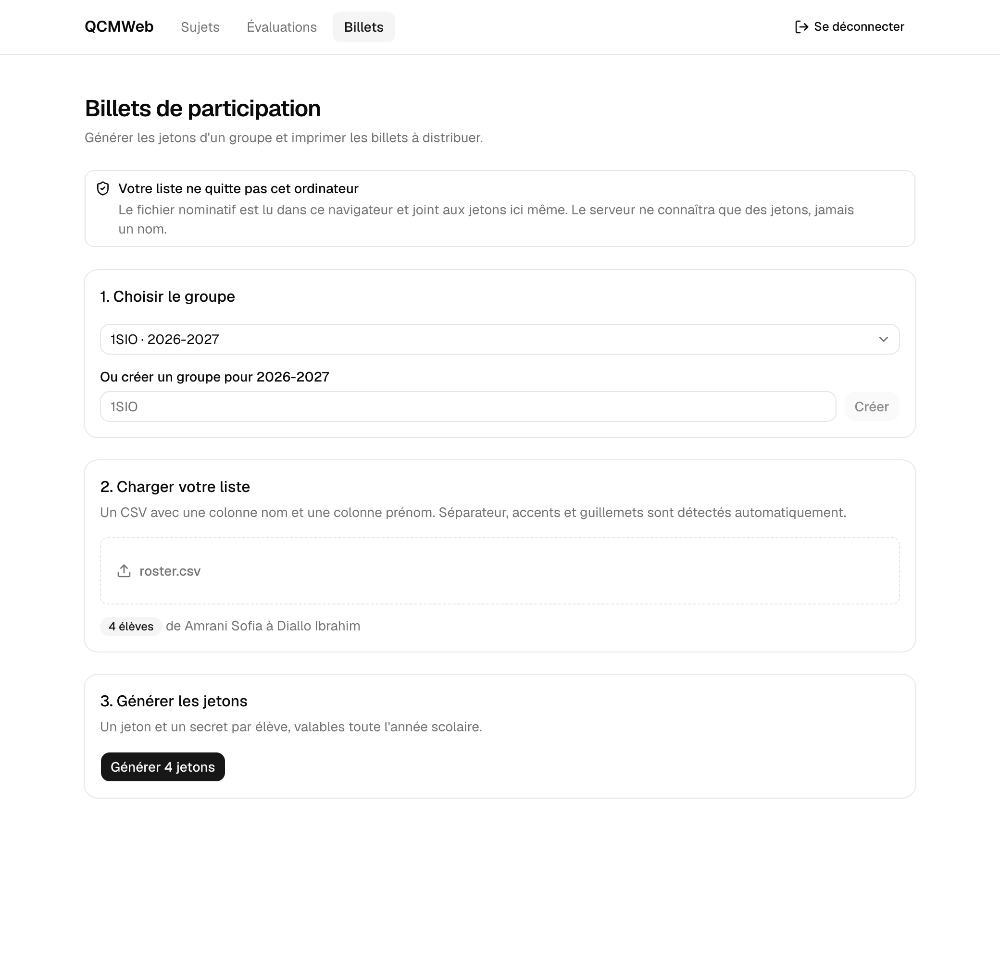

### 2.3. Générer les jetons

Cliquez sur **Générer N jetons**. L'application crée, pour chaque élève, un
**jeton** (son identifiant) et un **secret** (son mot de passe), et les
associe aux noms — toujours uniquement dans votre navigateur.

Comptez quelques secondes pour une classe entière : chaque secret est chiffré
individuellement avant d'être envoyé au serveur.

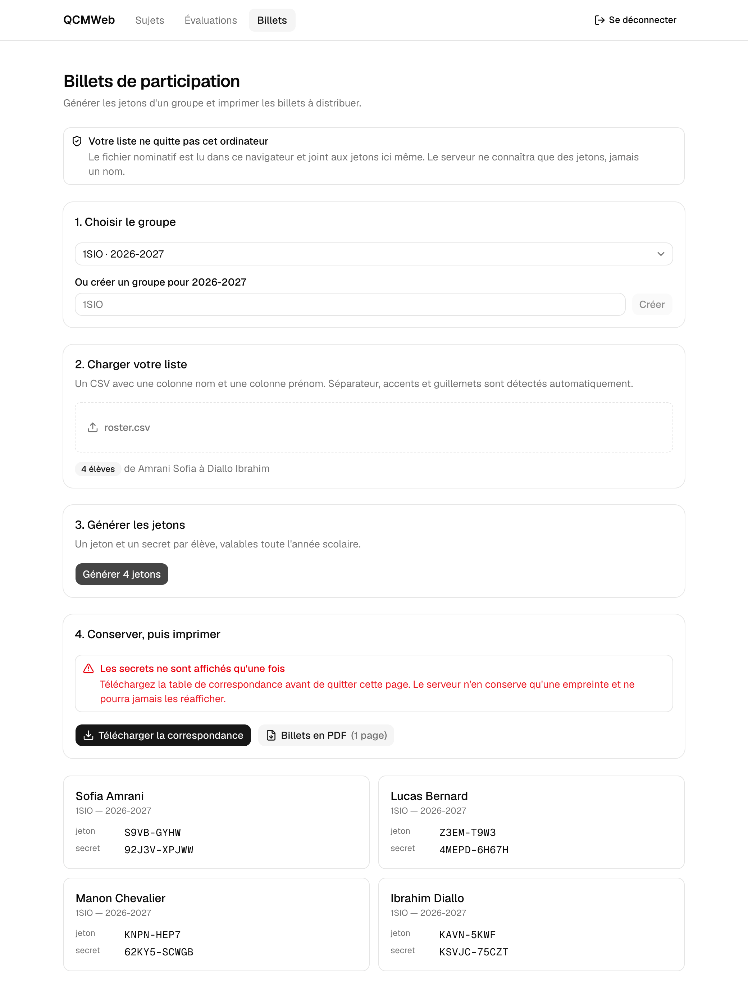

**Ces secrets ne seront plus jamais affichés.** Téléchargez immédiatement la
table de correspondance (bouton **Télécharger la correspondance**) et
conservez ce fichier en lieu sûr, par exemple dans votre espace personnel de
l'établissement. C'est le seul document qui relie les jetons aux noms de vos
élèves : sans lui, vous ne pourrez plus savoir qui est qui, ni réinitialiser un
secret perdu à coup sûr (vous pourrez toujours régénérer un secret pour un
élève identifié, mais plus retrouver l'ancien).

### 2.4. Imprimer les billets

Cliquez sur **Billets en PDF**. Un fichier prêt à imprimer et à découper est
généré, avec un billet par élève :

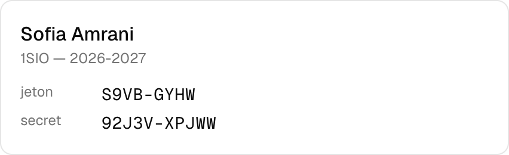

Distribuez un billet à chaque élève. C'est ce papier qui lui permettra de se
connecter (voir le [guide de l'élève](guide-eleve.md)) — il vaut son cahier de
texte : à conserver toute l'année.

> **Un jeton et un secret sont valables toute l'année scolaire.** Vous n'aurez
> à refaire cette opération qu'une fois par classe et par an, pas à chaque
> évaluation.

---

## 3. Obtenir un questionnaire

Un questionnaire (on parle de **sujet**) est un fichier texte au format
`qcm/v1`. Il décrit les questions, les réponses possibles, les bonnes réponses
et le barème.

### Le format en bref

```yaml
schema: qcm/v1

metadata:
  title: "HTTP et architecture Web"
  description: "Évaluation de fin de séance"
  subject: "BTS SIO"

questions:
  - id: http-method-get
    type: single_choice          # une seule bonne réponse
    prompt: |
      Quelle méthode HTTP est normalement utilisée
      pour demander une ressource sans la modifier ?
    choices:
      - id: a
        text: "POST"
      - id: b
        text: "GET"
        correct: true
      - id: c
        text: "DELETE"
    points: 1
    explanation: |
      GET est une méthode HTTP utilisée pour récupérer
      la représentation d'une ressource.

  - id: http-codes
    type: multiple_choice        # plusieurs bonnes réponses possibles
    prompt: "Parmi les codes suivants, lesquels sont des erreurs côté client ?"
    choices:
      - id: a
        text: "200"
      - id: b
        text: "404"
        correct: true
      - id: c
        text: "403"
        correct: true
      - id: d
        text: "500"
    points: 2
```

Trois types de questions existent : `single_choice` (une seule bonne réponse),
`multiple_choice` (plusieurs bonnes réponses possibles) et `true_false`
(vrai/faux). Le texte des questions et des réponses accepte la mise en forme
(gras, listes, et même du code informatique coloré), ce qui est pratique pour
un sujet d'informatique.

### Qui écrit ce fichier ?

**Vous n'avez normalement pas à écrire ce fichier vous-même.** C'est le rôle
d'un agent IA (un assistant comme Claude, connecté à QCMWeb) : vous lui donnez
vos objectifs pédagogiques ou votre cours, il rédige le questionnaire dans ce
format, le vérifie lui-même, puis le dépose. Vous n'avez plus qu'à le relire
(section suivante).

### Connecter votre assistant IA (une seule fois)

Cette étape est technique. Si vous n'êtes pas à l'aise, demandez à la personne
qui a installé QCMWeb pour votre établissement de la faire avec vous — cinq
minutes suffisent, et vous n'aurez plus jamais à la refaire.

1. La clé de connexion se crée sur le serveur, en ligne de commande :

   ```bash
   docker compose exec api qcmweb-api mint-key "Mon assistant"
   ```

   Elle s'affiche **une seule fois**. Notez-la immédiatement — sous la forme
   `qcmw_…` — dans un endroit sûr.

2. Dans les réglages de votre assistant IA (par exemple Claude Code ou Claude
   Desktop), ajoutez QCMWeb comme un outil externe (« serveur MCP »), avec
   l'adresse de votre établissement et la clé obtenue à l'étape précédente :

   ```json
   {
     "mcpServers": {
       "qcmweb": {
         "type": "http",
         "url": "https://qcm.mon-lycee.fr/mcp",
         "headers": { "Authorization": "Bearer qcmw_…" }
       }
     }
   }
   ```

**Ne collez jamais cette clé dans une conversation avec l'assistant** : elle
se configure une fois dans ses réglages, pas dans un message. Un secret tapé
dans une conversation peut se retrouver dans des journaux techniques.

Une fois connecté, votre assistant peut lire le format attendu, rédiger un
sujet, le vérifier lui-même et le déposer — mais **il ne peut ni le publier,
ni ouvrir une évaluation, ni approcher la liste de vos élèves**. Ces trois
actions vous reviennent entièrement, et c'est volontaire : voir la section
suivante.

---

## 4. Relire et valider le questionnaire

Quand votre assistant dépose un questionnaire, il apparaît dans l'onglet
**Sujets**, marqué **brouillon**. Un brouillon n'est visible que par vous —
aucun élève ne peut encore le voir.

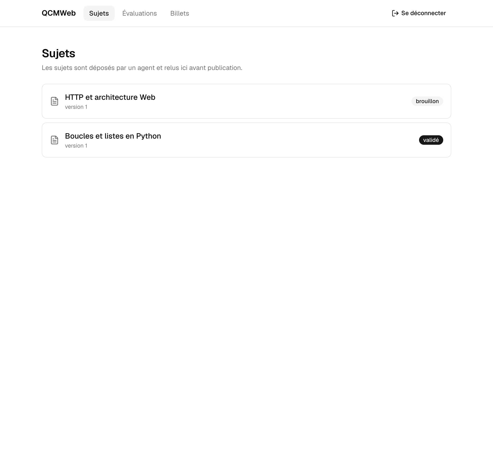

Cliquez sur le sujet pour le relire. Deux vues sont proposées.

**Vue élève** : exactement ce que verra votre classe, sans aucune bonne
réponse ni explication affichée.

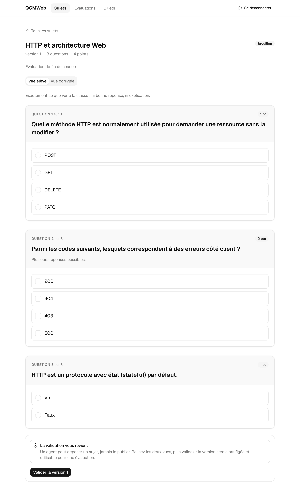

**Vue corrigée** : les bonnes réponses (en vert), les explications et le mode
de notation, pour vérifier que tout est juste.

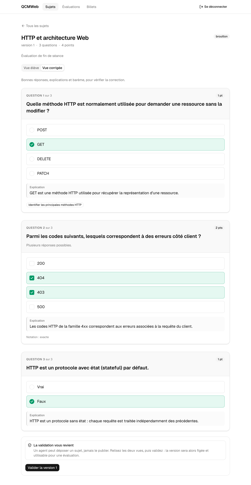

Si quelque chose ne va pas, redemandez une correction à votre assistant : il
déposera une nouvelle version, toujours en brouillon.

Une fois satisfait, cliquez sur **Valider la version**. Le sujet devient
utilisable pour une évaluation, et son contenu est désormais figé : le
modifier plus tard créera une nouvelle version, sans jamais changer
rétroactivement une évaluation déjà donnée à vos élèves.

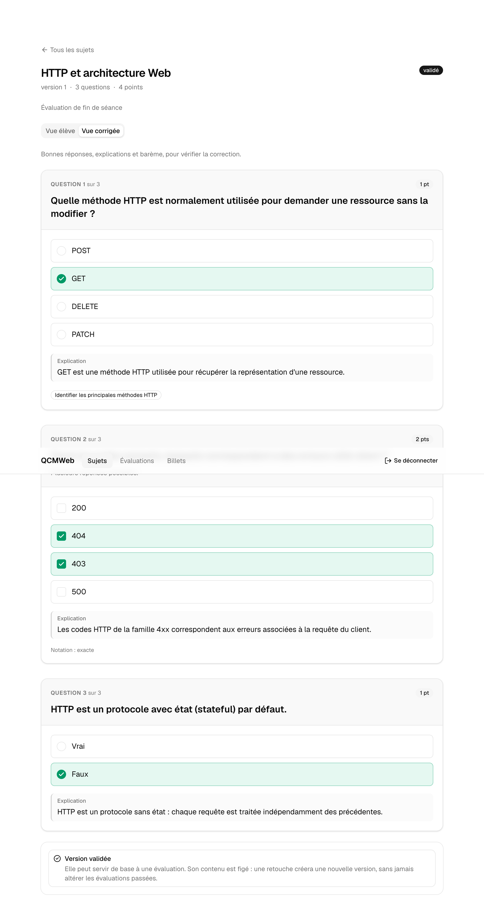

> **C'est la seule étape que ni votre assistant ni personne d'autre ne peut
> faire à votre place.** C'est volontaire : c'est la garantie qu'un
> questionnaire n'atteint jamais votre classe sans être passé sous vos yeux.

---

## 5. Créer et diffuser une évaluation

Une **évaluation**, c'est l'utilisation d'un sujet validé, à une date donnée,
avec un groupe donné. C'est en général votre assistant qui la crée pour vous
(il peut le faire directement, mais seulement sur un sujet déjà validé), et
elle apparaît alors dans l'onglet **Évaluations**.

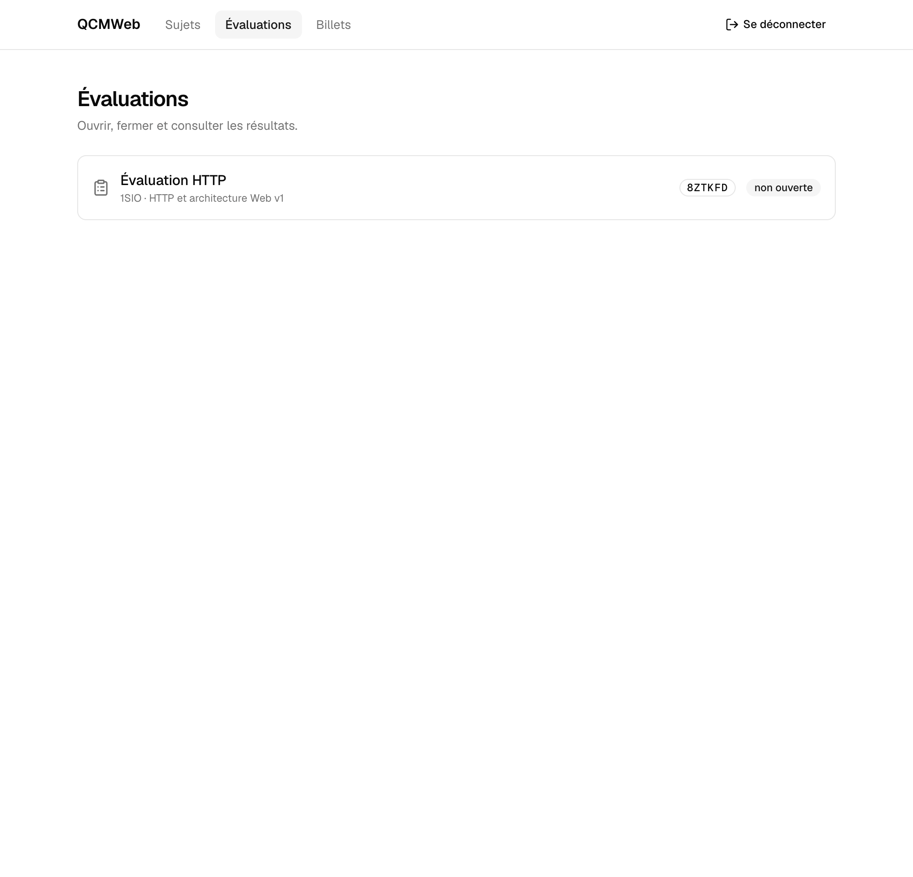

Ouvrez-la : elle possède un **code court** (par exemple `8ZTKFD`), déjà
généré, mais **fermée** — vos élèves ne peuvent pas encore y accéder.

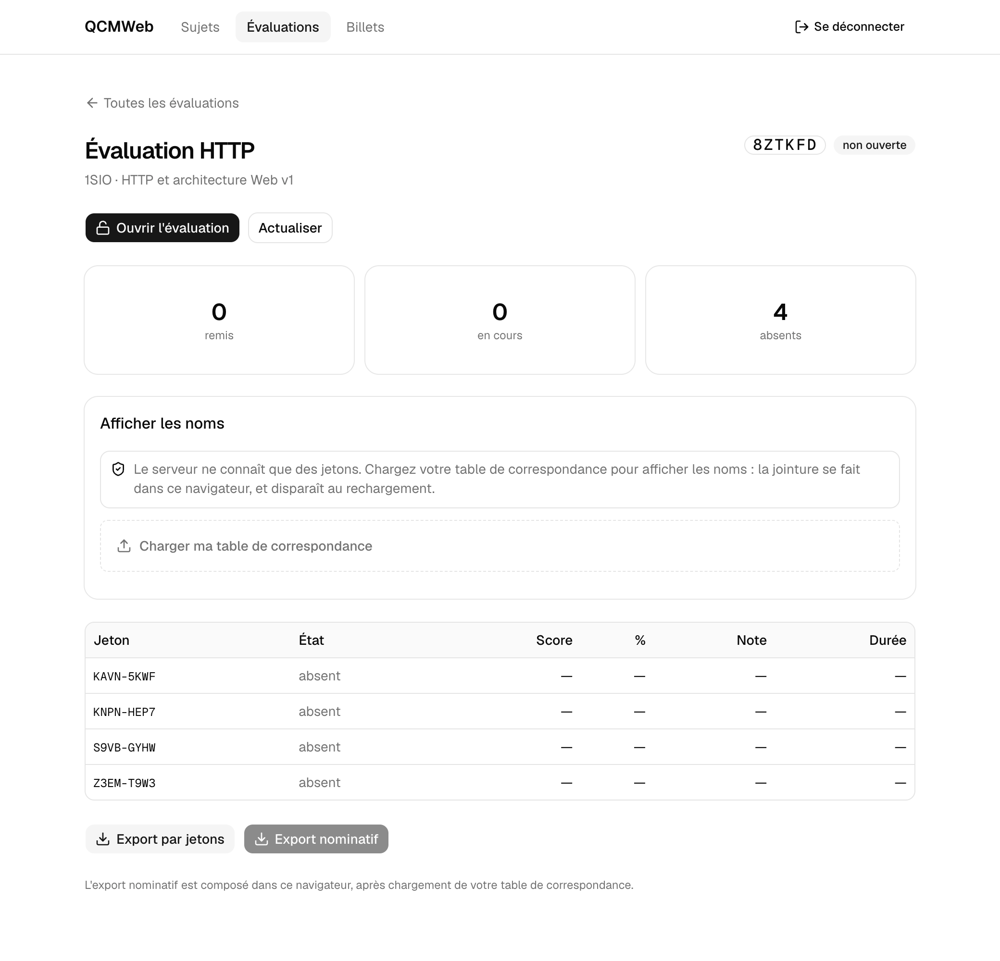

Quand vous êtes prêt à démarrer la séance, cliquez sur **Ouvrir
l'évaluation**, puis communiquez le code à votre classe (à l'oral, ou
projeté). Vos élèves l'utiliseront comme expliqué dans le [guide de
l'élève](guide-eleve.md).

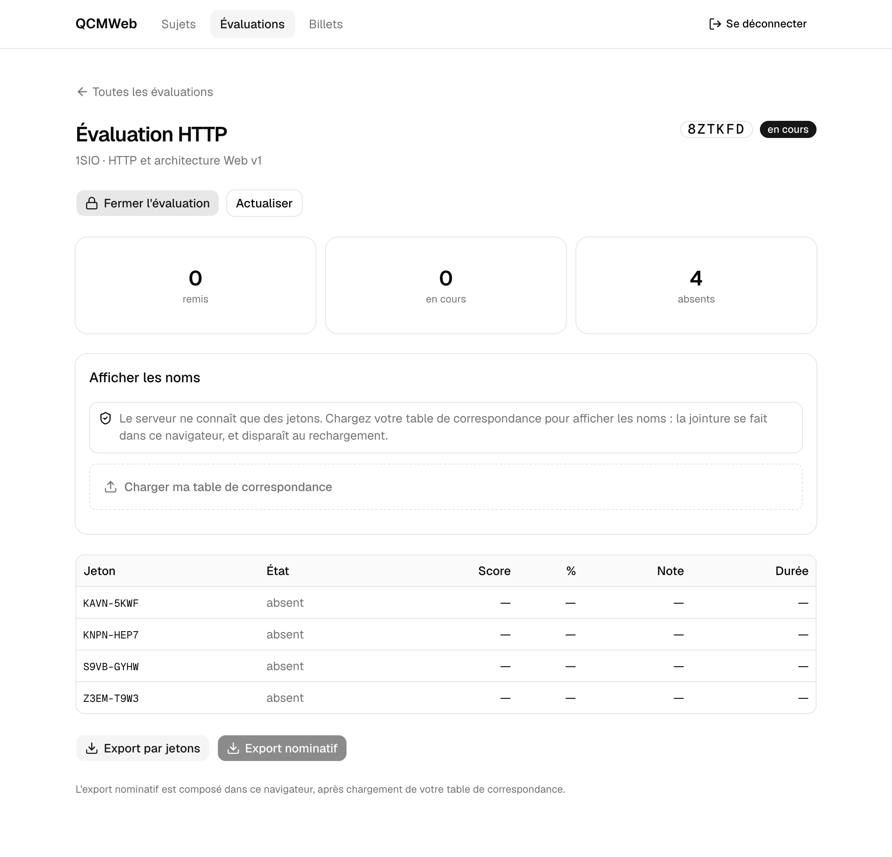

À la fin de la séance, cliquez sur **Fermer l'évaluation**. Vos élèves ne
pourront plus y répondre, mais vous pourrez toujours consulter les résultats.

---

## 6. Consulter et exporter les résultats

Toujours sur la page de l'évaluation, vous trouvez le tableau des résultats,
mis à jour au fil des copies rendues.

Par défaut, il affiche des **jetons**, pas des noms : le serveur ne connaît
que cela.

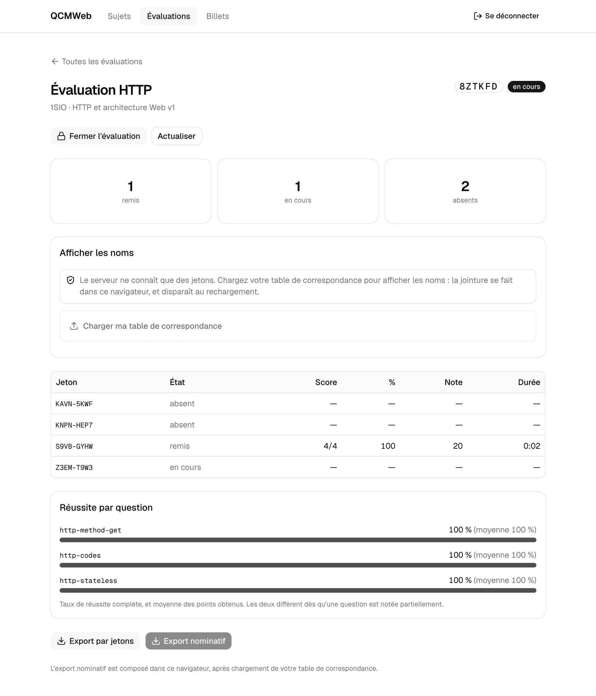

Pour afficher les noms, cliquez sur **Charger ma table de correspondance** et
sélectionnez le fichier téléchargé à l'étape 2.3. La jointure se fait dans
votre navigateur ; elle disparaît si vous rechargez la page, et rien n'est
envoyé au serveur.

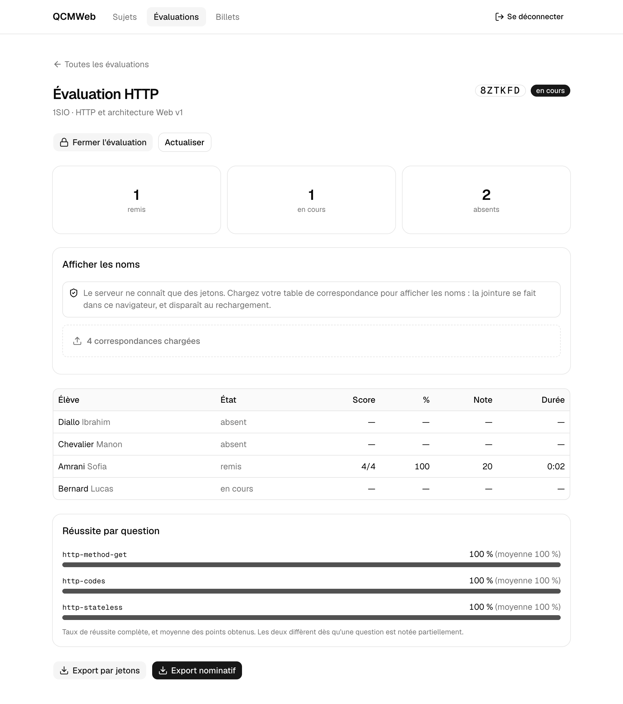

Ce tableau vous montre, pour chaque élève : s'il a **remis** sa copie, s'il est
**en cours**, ou **absent**, son score, son pourcentage, sa note sur 20 et la
durée de sa copie. Plus bas, la **réussite par question** vous indique
immédiatement quelles notions ont posé problème à la classe — particulièrement
utile en évaluation formative.

### Exporter

Deux boutons en bas de page :

- **Export par jetons** : un fichier tableur produit par le serveur, sans
  aucun nom.
- **Export nominatif** : un fichier avec les noms, composé dans votre
  navigateur (disponible seulement après avoir chargé la correspondance) —
  pratique pour reporter les notes dans votre logiciel habituel.

---

## 7. Questions fréquentes

**J'ai perdu la table de correspondance d'un groupe.**
Vous pouvez toujours réinitialiser le secret d'un élève identifié (il recevra
un nouveau billet), mais vous ne pourrez plus retrouver, à partir des seuls
résultats stockés sur le serveur, quel jeton correspondait à quel élève.
Conservez ce fichier comme vous conservez votre cahier de notes.

**Un élève a perdu son billet.**
Réinitialisez son secret depuis la fiche du groupe : un nouveau billet est
généré pour lui, l'ancien cesse de fonctionner.

**Puis-je transférer un élève vers un autre groupe en cours d'année ?**
Oui, cette action est disponible sur la fiche du participant. Son jeton et son
historique de résultats sont conservés.

**Que se passe-t-il en fin d'année ?**
Les jetons d'un groupe peuvent être purgés (détruits, avec les tentatives
associées) une fois l'année terminée. C'est une action volontaire, à faire
vous-même — rien n'est supprimé automatiquement dans votre dos.

**Un élève peut-il tricher en changeant d'onglet pendant l'épreuve ?**
L'application ne fait pas de surveillance intrusive (pas de détection de
changement d'onglet ni de sortie du plein écran) : ce n'est pas fiable et cela
pénaliserait des élèves de bonne foi. Les vrais garde-fous sont le mélange des
questions et des réponses, la durée limitée et le nombre de tentatives, que
vous réglez à la création de l'évaluation.

**Est-ce conforme au RGPD ?**
L'application est conçue pour minimiser au maximum les données conservées :
aucun nom, aucune donnée personnelle autre que les résultats pseudonymisés
n'est hébergé sur le serveur. Cela dit, un jeton reste rattachable à un élève
tant que vous détenez la table de correspondance : ce n'est pas un dispositif
« hors RGPD », c'est un dispositif qui en réduit fortement les risques. Le
registre de traitement de votre établissement reste du ressort de votre chef
d'établissement.
